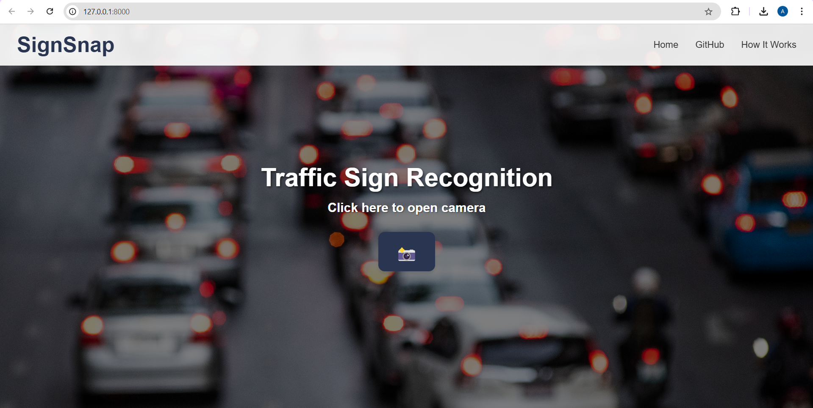
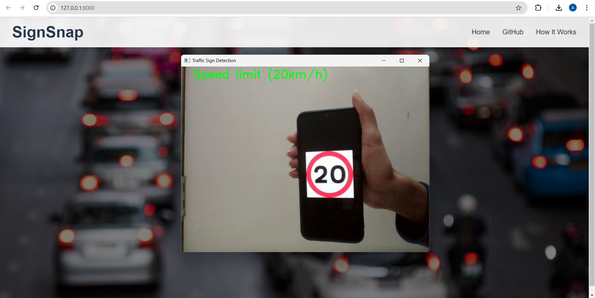

# SignSnap: Real-Time Traffic Sign Recognition with Audio Feedback

## Overview
**SignSnap** is a real-time traffic sign recognition system powered by machine learning. The system detects and classifies traffic signs using Convolutional Neural Networks (CNN) and provides immediate audio feedback to assist drivers in staying informed of important road signs. The project aims to improve road safety by reducing human error in traffic sign recognition.

## Features
- **Real-Time Detection**: Recognizes traffic signs from live camera feed.
- **Audio Feedback**: Alerts drivers with spoken descriptions of detected signs.
- **High Accuracy**: Uses a CNN-based machine learning model to classify signs.
- **User-Friendly Interface**: Includes a Flask-based frontend for easy interaction.

## Usage

1. Once the application is running, the system will use your device's camera to detect traffic signs in real-time.
2. When a sign is detected, the system will display the sign's name on the screen and provide audio feedback using text-to-speech (TTS).
3. You can interact with the application through the browser-based Flask interface, which provides additional options for tuning and controlling the system.

## System Architecture

1. **Traffic Sign Detection**: Uses a CNN-based model to detect traffic signs from camera frames.
2. **Traffic Sign Recognition**: Another CNN model classifies the detected signs into specific categories (e.g., speed limits, no entry, stop signs).
3. **Audio Feedback**: The detected sign is announced through a TTS engine (e.g., pyttsx3).
4. **Flask Web Interface**: A lightweight interface allows users to monitor system performance and interact with the application.

## Technologies Used
- **Programming Language**: Python
- **Libraries**: Keras, TensorFlow, OpenCV, pyttsx3
- **Framework**: Flask (for the web interface)

